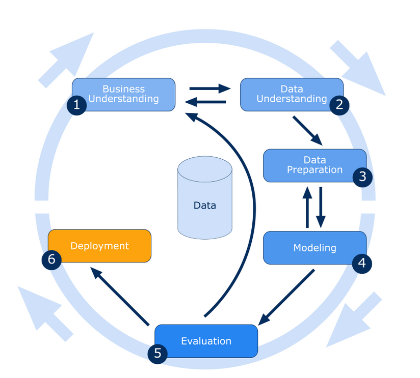

# Integração do CRISP-DM ao Fluxo de Processo:
- Fases do CRISP-DM:
- Entendimento do Negócio
- Entendimento dos Dados
- Preparação dos Dados
- Modelagem
- Avaliação
- Implementação

## 1. Solicitação Inicial e Triagem da Solicitação
**Entendimento do Negócio (Fase 1 do CRISP-DM)**
* Compreender os objetivos do negócio e os requisitos do cliente.
* Identificar as perguntas que o produto de dados deve responder.
* Alinhar as metas do projeto com as metas de negócio do cliente.
## 2. Reunião de Kickoff
**Entendimento do Negócio (Continuação)**
* Detalhar os objetivos e metas com o cliente.
* Definir KPIs e métricas de sucesso.
* Entendimento dos Dados (Fase 2 do CRISP-DM)
* Identificar as fontes de dados.
* Compreender a disponibilidade, qualidade e relevância dos dados.
## 3. Definição do Escopo e Planejamento
**Preparação dos Dados (Início da Fase 3 do CRISP-DM)**
* Planejar a extração, transformação e carregamento (ETL) dos dados.
* Definir a infraestrutura e as ferramentas necessárias.
## 4. Desenvolvimento
**Preparação dos Dados (Continuação da Fase 3 do CRISP-DM)**
* Coletar e limpar os dados.
* Transformar os dados para torná-los adequados para análise.
* Modelagem (Fase 4 do CRISP-DM)
* Desenvolver modelos analíticos e/ou construir o dashboard ou relatório.
* Testar diferentes técnicas de visualização e análise para encontrar a melhor abordagem.
## 5. Revisão Interna
**Avaliação (Fase 5 do CRISP-DM)**
* Avaliar a precisão e a qualidade dos resultados internos.
* Realizar validações e testes internos.
## 6. Revisão com o Cliente
**Avaliação (Continuação)**
* Apresentar os resultados ao cliente e coletar feedback.
* Fazer ajustes com base nas sugestões do cliente.
* Garantir que o produto atenda às expectativas e requisitos do cliente.
## 7. Entrega Final
**Implementação (Fase 6 do CRISP-DM)**
* Entregar o produto final ao cliente.
* Fornecer treinamento e documentação necessária para o uso do produto.
* Implementar o produto no ambiente de produção, se aplicável.
## 8. Suporte e Manutenção
* Implementação (Continuação)
* Manter o produto e fornecer suporte contínuo.
* Atualizar e melhorar o produto conforme necessário.
## 9. Avaliação Pós-Projeto
**Avaliação (Revisão Final)**
* Realizar uma análise pós-projeto para avaliar o sucesso e * identificar lições aprendidas.
* Coletar feedback formal do cliente.